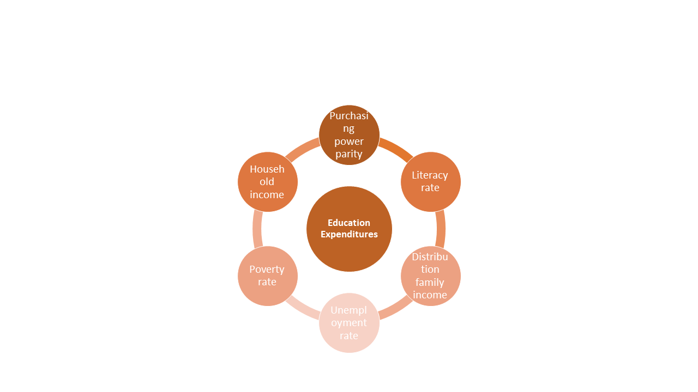
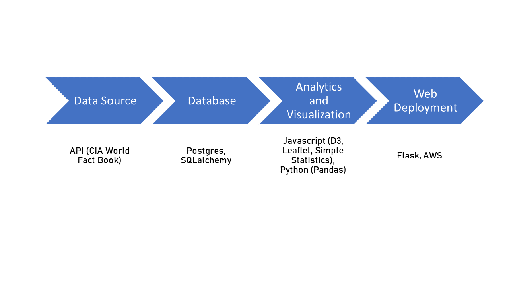
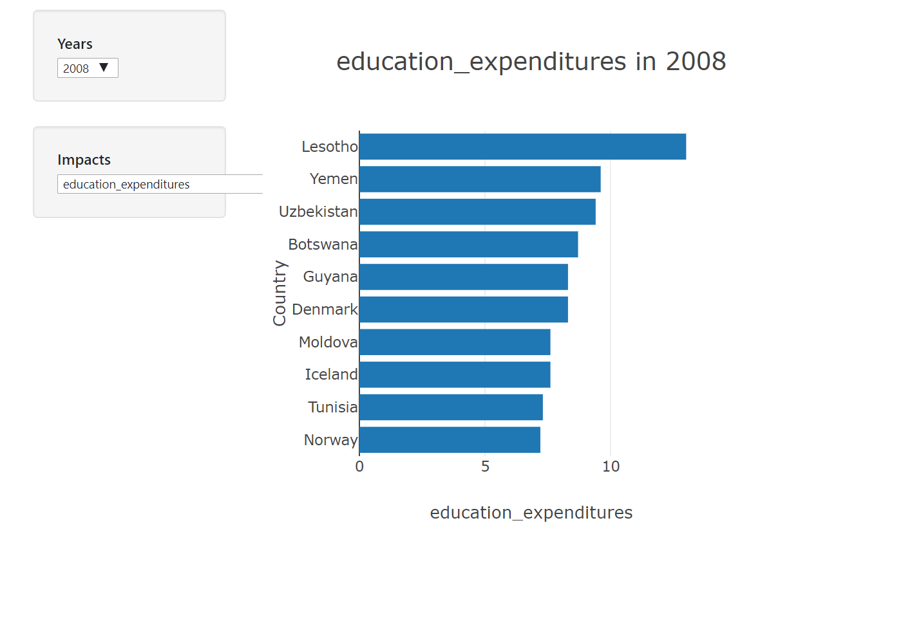
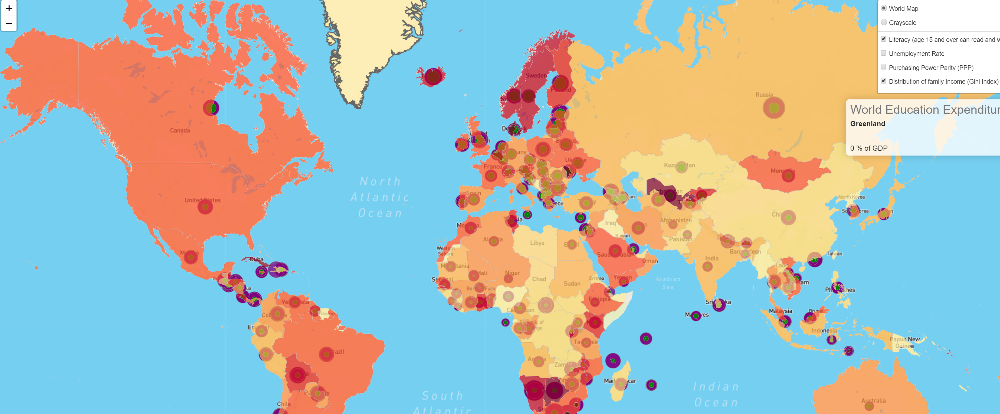
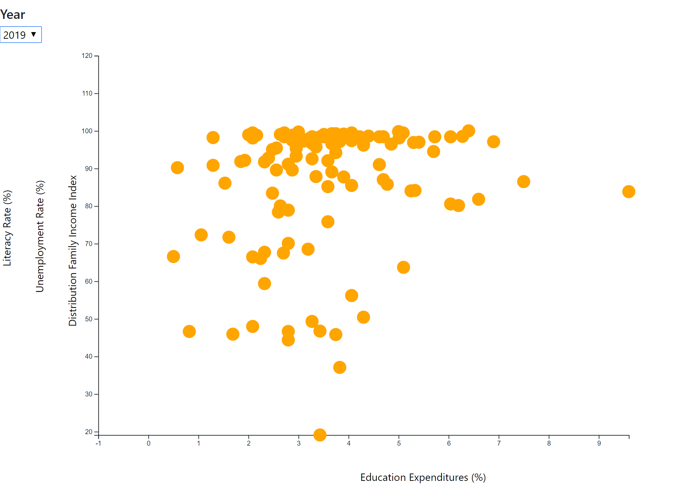

# Project 2 - Web and Visualization Project
## Impact of Education Expenditures on Life Quality

Team Member - Norman Gwinn, Panarat Duke, Gini Arimbi, Sarah Sutar

Data Analytics Bootcamp - Rice University

Web Link http://project2norman-env.eba-bjwapiwk.us-east-2.elasticbeanstalk.com/

### 1. Background 

**Project Background: ** In this project, we are required to deploy a web application consisting of interactive data visualization, API, and database.  

**Why we chose the dataset: ** It is interesting to see how country prioritize education on their national budget and what are the impacts on the life quality. 
Our initial hypothesis is that the higher percentage of education expenditures will directly proportion to the imporvement of life quality parameter. 

**Data Source: ** CIA World Factbook. Link: http://education-env.eba-zpu6tvez.us-east-2.elasticbeanstalk.com

### 2. Methodology

### 3. File Directory

HTML File will be under  `templates` folder with `index.html` as the main page.

Javascript will be under `static/js` folder

CSS and style-related files will be under `static/css`

Images and thumbnail files will be under `static/img`

Link to the website `http://project2norman-env.eba-bjwapiwk.us-east-2.elasticbeanstalk.com`

External Javascript library is using `simple-statistics`

### 3. Visualization Tools

a. Visualization 1: World Map

Shows the spread of country's education expenditure, literacy rate, unemployment rate, PPP, and distribution income index.

b. Visualization 2: Bar Plot

Shows top 10 countries with highest education expenditure and other parameter. 

b. Visualization 3: Scatter Plot

Shows correlation between education and 3 parameter (literacy rate, unemployment rate, distribution income index) 

* File output is `etl_project.ipynb` 

### 4. Conclusion and Observation 

From the world map, we can see that countries have different budget priority. There are some outliers countries where the results are different than hypothesis.  
We can observe trend on certain regions. 

From the bar chart: countries priority and life quality change thourhgout the years. 

From scatter plot: positive trend between education expenditures and the 3 parameter although the correlation is not strong. 

### 5. Limitation and Future Application

There are still many outliers that impact the correlation result. 

The visualization tools can be used for other economic / international relations studies. 
It can be done to observe general or specific trend on the impact of budget, such as the impact of health care budget to country's health quality.  

